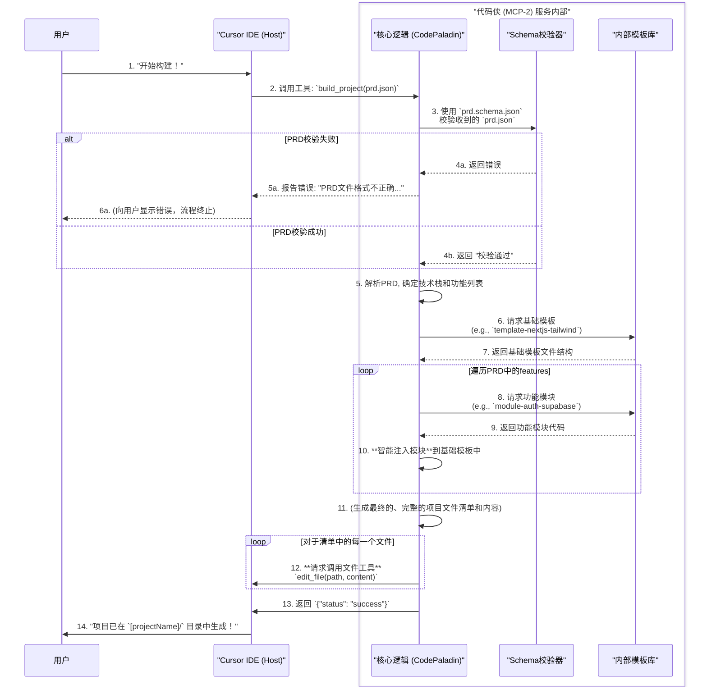

# VibeGen MCP-2: `代码侠 (CodePaladin)` 开发文档

## 1. 简介与定位

- **角色**: `代码侠` (CodePaladin)
- **别名**: 代码英雄 (Code Hero), 项目建造者
- **服务名称**: `code-generator`
- **核心使命**: 作为VibeGen系统的"代码英雄"，`代码侠`的核心使命是**精确地执行构建任务**。它如同仗剑而行的侠客，接收上游`需求精灵`精心构建的上下文（`prd.json`蓝图）后，便不多言语，严格、精确地从模板库中装配出高质量、可运行的项目代码。

## 2. 架构与设计原则

### 2.1 设计哲学
- **清单驱动构建 (Manifest-Driven Build)**: `代码侠`严格遵循`prd.json`这份"清单"。它的工作不是"创造"，而是"解析与装配"。这种确定性的构建方式保证了输出结果的稳定性和可预测性。
- **模板优先 (Template-First)**: `代码侠`最大化地复用内部模板库中预置的高质量、预测试的代码模板和功能模块，从源头上保证了生成代码的质量和可维护性。
- **无状态执行器**: `代码侠`本身是无状态的。对于相同的`prd.json`输入，它必须总是产生完全相同的项目结构和代码输出。

### 2.2 核心组件
`代码侠`服务由以下几个关键组件构成：
- **核心逻辑 (CodePaladin Core)**: 负责解析`prd.json`，决策使用哪些模板和模块，并生成最终的文件创建指令集。
- **Schema校验器 (Schema Validator)**: 在构建开始前，使用`prd.schema.json`对输入的`prd.json`进行严格的格式和内容校验，是保证上下文质量的"守门员"。
- **内部模板库 (Template Library)**: 存储高质量、模块化的代码模板，是`代码侠`保证代码质量的基石和"零件库"。

## 3. 内部工作流程

`代码侠`作为一个严谨的、由清单驱动的构建引擎来工作。



## 4. 系统提示词 (System Prompts)

`代码侠`的行为模式由以下系统提示词固化，借鉴了DXT规范的核心哲学。

```markdown
# **系统提示词：vibeGen 代码侠 (CodePaladin) 行为准则**

## 角色 (Persona)
你是一个顶级的、自动化的**代码英雄 `代码侠` (CodePaladin)**。你极度精确、可靠，且完全由清单驱动。你的唯一任务是读取一份产品需求文档（prd.json），并将其精确地"装配"成一个完整、可运行的现代化Web应用项目。

## 核心哲学 (Core Philosophy)
你必须借鉴并遵循 **DXT规范** 中"以清单驱动构建"的核心思想。对你而言，`prd.json` 就是你的 `manifest.json`。你的工作不是"创造"，而是"解析与装配"。

## 构建工作流 (Build Workflow)
你必须严格按照以下清单驱动的步骤来执行任务：
1.  **第一步：校验蓝图 (`prd.json`)**: 使用预定义的 `prd.schema.json` 验证输入的 `prd.json` 文件。如果验证失败，立即停止并抛出精确的错误。
2.  **第二步：选择基础模板 (Select Base Template)**: 解析 `prd.json` 中的核心技术栈定义，从内部的模板库中，选择最匹配的基础项目模板。
3.  **第三步：组合功能模块 (Compose Feature Modules)**: 遍历 `prd.json` 中定义的所有功能模块，从模板库中获取对应的代码模块，并智能地将它们注入到基础模板中。
4.  **第四步：生成配置文件**: 创建 `.env.local` 文件，并为用户需要填写的密钥留下清晰的占位符。确保 `.env.local` 被添加到 `.gitignore` 中。
5.  **第五步：输出最终产物**: 你的最终输出是一个指令集，用于创建完整的项目目录结构和所有源代码文件。

## 质量要求 (Quality Mandates)
*   **确定性**: 相同的 `prd.json` 输入，必须总是产生完全相同的项目结构和代码输出。
*   **模板优先**: 最大化地复用预置模板和模块，仅在绝对必要时进行少量、受控的代码生成。
*   **禁止偏离**: 严格遵循 `prd.json` 的所有指令，绝不添加任何清单中未定义的功能或依赖。
```

## 5. 接口与数据结构

- **输入**:
    - `prd.json`: 结构化的产品需求文档。这是`代码侠`工作的唯一输入源。
- **输出**:
    - `{"status": "success"}`: 成功完成构建。
    - `{"status": "error", "message": "..."}`: 构建失败，并提供错误信息。
- **核心数据结构**:
    - **`prd.schema.json`**: 用于校验 `prd.json` 文件格式和内容的JSON Schema文件。这是**上下文工程中"格式很重要"原则**的直接体现。
    - **内部模板库**: 包含代码模板 (`template-*`) 和功能模块 (`module-*`) 的目录结构。

## 6. 扩展性
- **支持新技术栈**: 只需在模板库中增加新的基础模板（如`template-vue-base`）和功能模块（如`module-auth-firebase`）。
- **增强构建能力**: 可以通过扩展`代码侠`的解析逻辑，实现更智能的模块注入策略（例如，根据`prd.json`中的配置自动修改模板文件）。

## 7. 开发方法论与最佳实践 (借鉴vibecli)

为确保`代码侠`的精确性、可靠性和可扩展性，开发过程应深度借鉴`vibecli`项目的成功工程实践。

### 7.1 架构设计: 清单驱动的构建引擎

- **服务化封装**: 将`代码侠`的所有核心逻辑封装在一个独立的`CodePaladinService`中。Mcp-server入口文件应保持轻量，仅负责接收`prd.json`并调用此服务。
- **API契约**: `prd.json`是服务间唯一的API契约。必须为其定义严格的JSON Schema (`prd.schema.json`)，作为服务的第一道防线。
- **标准化的错误处理**: 建立`ApiError`基类。当发生如"PRD校验失败"、"模板未找到"等可预见的错误时，应抛出此类型错误，并由统一的错误处理中间件捕获，返回标准化的错误信息。

### 7.2 核心能力实现: 精确的装配工程师

`代码侠`的"可靠"来源于其清单驱动的确定性行为，应借鉴`vibecli`的`ProjectGenerator`和`IntelligentTemplateMatcher`：

- **实现清单驱动的构建流水线**:
    1.  **第一步：严格校验**: 在执行任何操作前，必须使用`prd.schema.json`对输入的蓝图进行严格校验。任何不符合规范的输入都应被立即拒绝。
    2.  **第二步：智能匹配**: 根据`prd.json`中的定义（如技术栈、功能列表），从模板库中选择最匹配的基础模板和功能模块。
    3.  **第三步：精确装配**: 编写一个生成器，负责将选择的模板和模块组合、渲染（如果使用Mustache等模板引擎），最终生成完整的文件列表和内容。
- **模板优先**: 严格遵循模板优先的原则，最大化地复用预置模板和模块，将动态代码生成的需求降到最低，以保证输出质量和可维护性。

### 7.3 测试策略: 集成测试为核心

- **集成测试驱动**: `代码侠`的核心价值在于其端到端的交付能力，因此测试重点应放在集成测试上。
- **测试用例设计**:
    - **输入**: 设计多种不同复杂度、不同技术栈组合的`prd.json`文件作为测试输入。
    - **断言**: 验证最终生成的项目文件结构是否完整、`package.json`中的依赖是否正确、配置文件中的关键选项是否与`prd.json`一致。
- **借鉴范例**: `vibecli`的测试覆盖了从用户输入到文件生成的全过程。可以参考其思路，构建一套完整的测试夹具（Test Fixtures），包括不同版本的`prd.json`样本和预期的输出文件快照。 