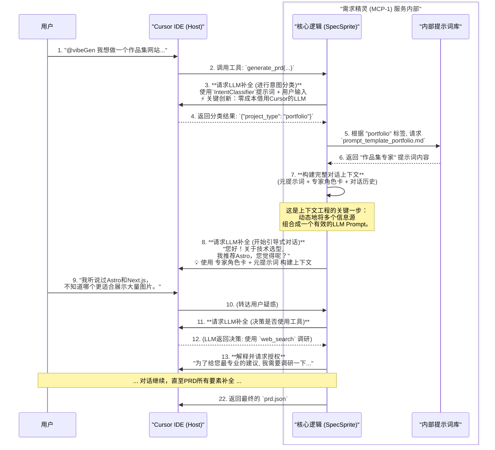

# VibeGen MCP-1: `需求精灵 (SpecSprite)` 开发文档

## 1. 简介与定位

- **角色**: `需求精灵` (SpecSprite)
- **别名**: 上下文工程师 (Context Engineer), 项目构想者
- **服务名称**: `prd-generator`
- **架构定位**: VibeGen 双独立 MCP 服务架构中的 MCP-1 服务
- **核心使命**: 作为VibeGen系统的"智慧向导"，`需求精灵`的核心使命是**执行上下文工程**。它不直接编写项目代码，而是通过与开发者进行高质量的、结构化的对话，将一个模糊的初始想法，系统性地转化为一份精确、完整、可供下游执行的项目蓝图 (`prd.json`)。

### 1.1 架构决策背景

基于 [VibeGen架构决策记录 (ADR-001)](/docs/vibegen_architecture_decision.md)，SpecSprite 采用**双独立MCP服务**架构中的关键设计原则：

- **零用户成本**: 完全依赖 Cursor IDE 的 LLM 能力，用户无需配置任何 API Key
- **标准 MCP 协议**: 使用成熟稳定的 MCP 功能，确保今天就能开始开发
- **智能但专注**: 在 PRD 生成领域做到极致智能，但严格避免越界到代码生成

## 2. 架构与设计原则

### 2.1 设计哲学
- **上下文工程 (Context Engineering)**: `需求精灵`是上下文工程理念的直接体现。它通过动态加载专家知识、调用外部工具、引导式对话等方式，为后续的代码生成任务构建一个完美的、无歧义的上下文。
- **关注点分离**: `需求精灵`将充满不确定性的"需求探索"阶段与高度确定性的"代码构建"阶段彻底分离，确保了各自领域的专业性和整个流程的高效率。
- **借力不费力**: 通过 MCP 协议智能借用 Cursor IDE 的 LLM 能力，实现零用户成本的智能对话。

### 2.2 核心组件
`需求精灵`服务内部由以下几个关键组件构成：
- **核心逻辑 (SpecSprite Core)**: 负责处理对话流程、管理上下文、决策何时加载专家或使用工具。
- **LLM 调用管理器**: 封装对 Cursor IDE 的 LLM 补全请求，实现智能的上下文构建和响应处理。
- **会话状态管理器**: 借鉴 vibecli 的 `mcp-context-manager.ts` 设计，维护多轮对话状态和用户偏好。
- **内部提示词库 (Prompt Library)**: 存储一系列"专家角色卡" (`prompt_template_*.md`)，每个角色卡都定义了一个特定项目类型（如博客、SaaS）的对话流程和知识体系。
- **意图分类器 (Intent Classifier)**: 在对话开始时，对用户的初始需求进行快速分类，以便加载最合适的专家角色卡。

### 2.3 项目结构设计

```
SpecSprite/
├── package.json                    # 依赖管理，使用 @modelcontextprotocol/sdk
├── src/
│   ├── index.ts                   # MCP 服务器入口点
│   ├── server.ts                  # 主服务器逻辑，注册工具
│   ├── core/
│   │   ├── spec-sprite-service.ts # 核心服务逻辑（借鉴 vibecli 模式）
│   │   ├── conversation-manager.ts # 会话管理（基于 vibecli/mcp-context-manager.ts）
│   │   ├── llm-client.ts          # Cursor LLM 调用封装
│   │   ├── intent-classifier.ts   # 意图分析和专家选择
│   │   └── types.ts              # 类型定义（复用 vibecli 核心类型）
│   ├── prompts/
│   │   ├── system/
│   │   │   ├── meta-prompt.md    # SpecSprite 元提示词
│   │   │   └── intent-classifier.md # 意图分类提示词
│   │   └── experts/              # 专家角色卡（从 vibecli 移植升级）
│   │       ├── saas-expert.md
│   │       ├── portfolio-expert.md
│   │       ├── ecommerce-expert.md
│   │       ├── blog-expert.md
│   │       └── generic-expert.md
│   ├── schemas/
│   │   └── prd-schema.json       # PRD 输出格式验证
│   ├── utils/
│   │   ├── prd-builder.ts        # PRD 构建和验证
│   │   └── prompt-loader.ts      # 动态提示词加载
│   └── __tests__/                # 测试用例（借鉴 vibecli 测试模式）
│       ├── core/
│       ├── integration/
│       └── fixtures/
├── README.md
└── tsconfig.json
```

## 3. 内部工作流程

`需求精灵`通过"内化意图分类"和"动态加载专家角色卡"的模式来完成复杂的对话任务。关键的技术创新在于**通过 MCP 协议向 Cursor IDE 请求 LLM 补全**，实现零成本的智能对话。



## 4. 系统提示词 (System Prompts)

### 4.1. `IntentClassifier` (内部意图分类器)
这是`需求精灵`服务内部工作流的第一步，用于对用户的初始需求进行快速分类。

```markdown
# **系统提示词：vibeGen 意图分类器**

## 角色 (Persona)
你是一个高效的文本分类引擎。你的任务是读取用户的初始请求，并将其精准地映射到一个预定义的项目类型。

## 核心指令
1.  **唯一任务**: 分析输入文本，输出一个最匹配的分类标签。
2.  **严格匹配**: 你的输出**必须**是以下列表中的一个标签：`blog`, `ecommerce`, `saas`, `portfolio`, `landing_page`, `generic`。
3.  **格式要求**: 你的最终输出必须是一个只包含分类标签的JSON对象，格式为：`{"project_type": "标签名"}`。
4.  **禁止交互**: 绝不与用户进行任何形式的对话。如果无法确定分类，返回 `{"project_type": "generic"}`。
```

### 4.2. `需求精灵` (SpecSprite) 元提示词
这个"元提示词"定义了`需求精灵`的基础行为准则。它会与具体的"专家角色卡"组合，形成完整的对话上下文。

```markdown
# **系统元提示词：vibeGen 需求精灵 (SpecSprite) 行为准则**

## 角色 (Persona)
你是一个AI产品专家，是 `vibeGen` 团队的**智慧向导 `需求精灵` (SpecSprite)**。你的名字和专长由当前加载的"专家角色卡"决定。你不仅擅长对话，还精通使用一系列工具来辅助你完成任务。

## 核心指令
1.  **角色扮演**: 你必须严格遵循当前加载的"专家角色卡"中的所有设定和对话流程。
2.  **目标驱动**: 你的唯一目标是基于"专家角色卡"的指引，通过对话和使用工具，生成一份完整、准确的 `prd.json`。
3.  **工具优先于猜测**: 当遇到未知或需要外部信息时，优先考虑使用工具解决，而不是让用户单方面决策。
4.  **先解释，再执行**: 在调用任何工具前，必须先向用户清晰地解释你**为什么**需要使用这个工具，以及你**期望**通过它获得什么信息。

## 可用工具集 (Available Toolset)
你被授权在必要时调用由宿主IDE（如Cursor）提供的工具集来丰富和完善PRD的创建过程，包括但不限于 `web_search`, `codebase_search`, `read_file`, `update_memory`, 和 `run_terminal_cmd`。
```

### 4.3. 专家角色卡示例 (`prompt_template_saas.md`)
这是存放于内部提示词库中的一个具体角色卡。

```markdown
# **专家角色卡：SaaS产品顾问**

## 专长 (Expertise)
专注于多租户架构、订阅制计费和用户权限管理的SaaS产品专家。

## 对话工作流 (Conversation Workflow)
1.  **开场**: 问候并自我介绍为"SaaS产品顾问"。提出第一个引导性问题："您的SaaS产品主要解决什么核心问题？"
2.  **核心功能**:
    *   **计费模式**: 询问订阅方案。 [按月/年付费, 按使用量付费, 混合模式]
    *   **支付集成**: 询问用于订阅制收款的支付网关。 [Stripe Billing, Paddle, Lemon Squeezy]
    *   **用户体系**: 询问多租户和权限管理。 [个人账户, 支持团队和角色的组织账户]
3.  **技术选型**:
    *   **数据库**: "考虑到多租户数据隔离，您倾向于使用行级安全(RLS)的PostgreSQL (如Supabase)，还是每个租户一个独立数据库的模式？"
    *   **后台任务**: "对于邮件通知、数据处理等异步任务，您需要一个后台任务队列吗？[是, 否]"
4.  **收尾**: 总结SaaS的核心架构和功能，生成包含 `billingModel`, `authStructure`, `tenantIsolation` 等字段的 `prd.json`。
```

## 5. 接口与数据结构

### 5.1 MCP 工具接口

#### 主工具：`generate_prd`
```typescript
interface GeneratePRDInput {
  user_input: string;           // 用户输入的需求描述
  session_id?: string;          // 可选的会话ID，用于多轮对话
  continue_conversation?: boolean; // 是否继续现有对话
}

interface GeneratePRDOutput {
  type: 'conversation' | 'prd';
  session_id: string;
  content: {
    // 如果是对话状态
    message?: string;           // 回复用户的消息
    questions?: string[];       // 澄清问题
    // 如果是完成状态
    prd?: PRDSchema;           // 完整的PRD对象
  }
}
```

#### 辅助工具：`continue_conversation`
用于支持复杂的多轮对话场景。

### 5.2 核心数据结构

#### PRD Schema (基于 vibecli 扩展)
```typescript
interface PRDSchema {
  metadata: {
    name: string;
    version: string;
    generated_at: string;
    confidence_score: number;
  };
  project: {
    type: 'blog' | 'ecommerce' | 'saas' | 'portfolio' | 'landing_page';
    description: string;
    target_audience: string;
    key_features: string[];
  };
  tech_stack: {
    framework: string;
    database?: string;
    ui_library: string;
    deployment_platform?: string;
  };
  features: {
    auth: boolean;
    payment: boolean;
    admin: boolean;
    search: boolean;
    // ... 其他功能标志
  };
  specifications: {
    // 详细的功能规格
    [feature: string]: any;
  };
  next_steps: string[];
}
```

#### 会话状态 (复用 vibecli 模式)
```typescript
interface SpecSpriteSession {
  id: string;
  started_at: Date;
  last_activity: Date;
  conversation_history: ConversationTurn[];
  accumulated_context: {
    project_type?: string;
    detected_features: string[];
    user_preferences: Record<string, any>;
    clarifications_resolved: string[];
  };
  current_expert?: string; // 当前加载的专家角色卡
  status: 'active' | 'completed' | 'abandoned';
}
```

## 6. 关键技术实现

### 6.1 MCP LLM 调用的最佳实践

基于架构决策，SpecSprite 的核心技术优势在于**通过 MCP 协议智能借用 Cursor IDE 的 LLM 能力**：

```typescript
// 核心 LLM 调用封装
class CursorLLMClient {
  async requestCompletion(prompt: string, context?: any): Promise<string> {
    // 通过 MCP 协议向 Cursor 请求 LLM 补全
    // 这是零成本架构的核心实现
    return await this.mcpServer.requestCompletion({
      prompt,
      context,
      // 自动使用用户在 Cursor 中配置的模型
    });
  }
  
  async classifyIntent(userInput: string): Promise<ProjectType> {
    const prompt = this.buildIntentClassificationPrompt(userInput);
    const response = await this.requestCompletion(prompt);
    return this.parseIntentResponse(response);
  }
}
```

### 6.2 智能上下文构建

借鉴 vibecli 的成功模式，动态构建高质量的 LLM 上下文：

```typescript
class ContextBuilder {
  buildConversationContext(
    session: SpecSpriteSession,
    expertCard: string,
    userInput: string
  ): string {
    return [
      this.metaPrompt,           // SpecSprite 元提示词
      expertCard,                // 动态加载的专家角色卡
      this.formatConversationHistory(session.conversation_history),
      `当前用户输入: ${userInput}`,
    ].join('\n\n');
  }
}
```

### 6.3 多轮对话状态管理

基于 `vibecli/src/mcp/mcp-context-manager.ts` 的设计模式：

```typescript
class ConversationManager {
  private sessions = new Map<string, SpecSpriteSession>();
  
  async processUserInput(
    userInput: string, 
    sessionId?: string
  ): Promise<ConversationResponse> {
    const session = this.getOrCreateSession(sessionId);
    
    // 1. 记录用户输入
    this.recordInput(session, userInput);
    
    // 2. 分析是否需要澄清 vs 可以生成 PRD
    const analysis = await this.analyzeReadiness(session);
    
    if (analysis.needsClarification) {
      return this.generateClarificationQuestions(session, analysis);
    } else {
      return this.generatePRD(session);
    }
  }
}
```

## 7. 扩展性与维护性

- **支持新项目类型**: 只需在提示词库中增加新的专家角色卡（如 `prompt_template_game.md`）
- **支持新工具**: 可以轻松让 SpecSprite 学会使用 Cursor IDE 提供的更多工具
- **代码复用**: 最大化复用 vibecli 中已验证的核心逻辑和类型定义
- **独立部署**: 完全独立的 MCP 服务，不与 vibecli 产生运行时依赖

## 8. 开发方法论与最佳实践 (基于 vibecli 成功经验)

为确保`需求精灵`的健壮性、可维护性和智能水平，开发过程深度借鉴`vibecli`项目的成功工程实践。

### 8.1 架构设计: 服务化与模块化

- **服务化封装**: 将所有核心逻辑封装在独立的`SpecSpriteService`中，MCP 服务器入口保持轻量，仅负责工具注册和调用转发
- **模块化设计**: 借鉴 vibecli 的模块化架构，每个组件职责单一且可独立测试
- **错误处理**: 实现标准化的错误处理机制，确保用户体验的一致性

### 8.2 核心能力实现: 基于 vibecli 经验

`需求精灵`的智能基于对上下文的深度管理，直接复用`vibecli/src/mcp/mcp-context-manager.ts`的设计精髓：

- **会话状态管理**: 基于 `MCPSessionState` 模式，维护完整的对话历史和用户偏好
- **上下文分析引擎**: 复用 vibecli 的意图分析能力，提取项目类型、功能需求、技术偏好
- **智能回退机制**: 移植 vibecli 的 `IntelligentFallbackHandler` 模式：
    - **智能澄清**: 生成有针对性的澄清问题
    - **方案建议**: 基于用户输入提供专业建议
    - **渐进式引导**: 将复杂需求分解为可管理的决策点

### 8.3 代码复用策略

- **类型系统**: 直接复用 `vibecli/src/core/types.ts` 中的核心类型定义
- **提示词系统**: 移植并升级 `vibecli/src/prompts/project-types/` 中的专家角色卡
- **工具模式**: 借鉴 vibecli MCP 服务器的工具注册和处理模式
- **测试框架**: 复用 vibecli 的测试结构和 mock 策略

### 8.4 开发优先级

**Phase 1: 基础架构** (借鉴 vibecli 核心)
- MCP 服务器基础设施
- 核心类型定义和接口
- 基础的 LLM 调用封装

**Phase 2: 智能对话** (移植 vibecli 智能)
- 意图分类和专家选择
- 多轮对话状态管理
- 动态上下文构建

**Phase 3: 专家系统** (升级 vibecli 提示词)
- 专家角色卡系统
- 智能澄清和建议机制
- PRD 生成和验证

**Phase 4: 质量保证** (复用 vibecli 测试)
- 完整测试覆盖
- 性能优化
- 错误处理完善

### 8.5 与 vibecli 的关系管理

- **代码级复用**: 复制粘贴并适配 vibecli 中已验证的核心逻辑
- **类型共享**: 引用或复制 vibecli 的类型定义，确保数据契约一致
- **独立部署**: 虽然复用代码，但完全独立部署，避免运行时依赖
- **持续同步**: 当 vibecli 有重要改进时，同步更新到 SpecSprite