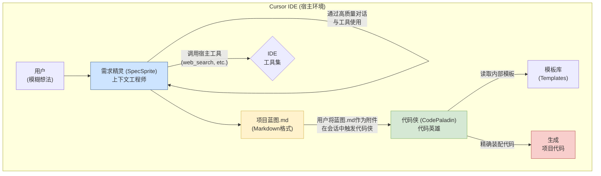

# 从单体到解耦：我如何用"寄生Agent"重新定义AI开发工具

> 三天开发，遇到瓶颈，散步中的一次对话，让我找到了AI智能体架构设计的新范式。

## 引子：一个开发者的困惑

作为一名AI工程师，我一直在思考一个问题：**如何让AI真正成为开发者的得力助手，而不是一个"智能"但不可控的黑盒？**

三天前，我开发了一个叫 `vibecli` 的工具，版本号已经到了 1.9.1。它的想法很简单：用一个AI Agent来帮助开发者从模糊的想法生成完整的项目代码。但在第三天，我遇到了瓶颈。

问题出在哪里？**通用了就没法干专业的事。**

## 单MCP模式的"耦合"之痛

在传统的单MCP（Model Context Protocol）模式下，一个AI Agent被迫成为"全能选手"：

- 它既要像产品经理一样，和用户聊需求、做调研、给建议
- 又要像架构师一样，做技术选型、规划项目结构  
- 最后还要像工程师一样，把所有东西转换成代码

这导致它的核心提示词（System Prompt）变得异常臃肿和矛盾。为了"通用"，它不得不牺牲"专业"。最终的结果就是，它在每个领域都表现平平，无法在任何一个点上做到极致。

这就是经典的软件工程问题：**耦合度过高，内聚性不足。**

## 散步中的顿悟

昨晚散步时，我和豆包（路上没法用其他大模型😅）聊起了这个困境。在那次对话中，一个概念突然清晰起来：

**为什么不把这个复杂的任务彻底解耦？**

就像微服务架构一样，将一个庞大的单体应用拆分成多个专业化的小服务，每个服务只专注做好一件事。

## VibeGen：双生英雄的诞生

基于这个思路，我重新设计了 **VibeGen**，采用了革命性的"双生英雄"架构：



### 🧙‍♂️ 需求精灵 (SpecSprite)
- **角色定位**：上下文工程师 + 项目构想者
- **核心职责**：通过高质量对话，将模糊想法转化为精确的项目蓝图（`prd.json`）
- **专业能力**：需求分析、技术调研、用户沟通

### ⚔️ 代码侠 (CodePaladin)  
- **角色定位**：代码英雄 + 项目建造者
- **核心职责**：严格按照蓝图，精确地装配出高质量代码
- **专业能力**：模板组装、代码生成、项目构建

### 关注点分离的威力

这种设计实现了完美的**关注点分离**：

1. **需求精灵**只关心一件事：如何通过高质量的对话和工具使用，将模糊的想法变成清晰、结构化的蓝图
2. **代码侠**也只关心一件事：如何严格按照蓝图，精确地把预设的模块"装配"成代码

两者之间通过 `prd.json` 这个标准化的"API契约"进行通信，实现了完全解耦。

### 技术基石：为什么是现在？

你可能会问，这种精巧的"双脑"架构，为什么直到今天才成为可能？

答案在于**大语言模型自身能力的跃迁**。

VibeGen的诞生，离不开像 **Claude 4 Sonnet** 这样新一代模型的强大支持。它的两个关键特性为VibeGen提供了坚实的技术土壤：

1.  **巨大的上下文窗口 (200k Tokens)**：这使得`需求精灵`有足够的"内存"与用户进行长时间、多轮次的深度对话，并能同时容纳专家知识、外部文档和工具调用结果，而不会丢失关键信息。这是进行复杂上下文工程的基础。
2.  **极高的执行精度**：模型在理解和遵循复杂指令上的精度大幅提升，使得`代码侠`能够更可靠地将结构化的`prd.json`蓝图，精确无误地转换为代码。执行精度的提升，是"代码即清单"模式能够落地的关键。

正是这些底层能力的突破，才让我们有机会从"通用"的单体Agent，迈向"专业"的多Agent协作新范式。

## "寄生Agent"：一个新的架构模式

在和群友讨论时，有人提出了一个精彩的概念：**这种MCP模式就是一种寄生的Agent模式。**

这个比喻太准确了！VibeGen 的AI智能体并不是独立运行的应用，而是"寄生"在宿主环境（如Cursor IDE）中：

### 寄生的特征
1. **依赖宿主环境**：所有能力都通过宿主提供的工具实现
2. **深度集成**：能实时感知和利用宿主环境中的丰富上下文
3. **能力互补**：AI提供智慧，宿主提供执行能力

### 从寄生到共生
这不仅仅是简单的依赖关系，更像是一种**互利共生**：

- **VibeGen** 获得了强大的执行能力和丰富的上下文
- **Cursor IDE** 获得了专业的项目规划与生成能力

## 对比：其他架构模式的思考

在研究过程中，我发现Reddit上的AI社区也在探讨类似的问题。有位开发者分享了一个叫"Ultrathink Task"的模式，这给了我很好的对比视角。

### "Ultrathink Task"模式分析

这种模式采用**单Agent协调四个虚拟子Agent**的架构：
- **Architect Agent** – 设计高层次方法
- **Research Agent** – 收集外部知识  
- **Coder Agent** – 编写代码
- **Tester Agent** – 提出测试策略

工作流程是：单个协调者Agent分步思考，为每个虚拟子Agent分派任务，然后进行"ultrathink"反思，结合所有洞察形成解决方案。

### 架构模式的根本差异

对比两种模式，核心差异非常明显：

**Ultrathink模式**：
- ✅ **实现简单**：只需要一个MCP服务
- ✅ **部署容易**：用户体验更流畅
- ❌ **假装专业**：实际上还是一个LLM在"角色扮演"
- ❌ **受限于通用性**：无法在任何领域达到真正的专业水平

**VibeGen模式**：
- ✅ **真正专业**：每个Agent都有独立、深度优化的专业能力
- ✅ **可扩展性强**：可以轻松添加新的专业Agent
- ✅ **上下文工程深度**：每个环节都经过精心的上下文设计
- ❌ **复杂度较高**：需要管理多个独立服务

### 为什么选择"真专业"而非"假专业"？

这让我想起了一个经典的技术选择：**单体架构 vs 微服务架构**。

Ultrathink模式就像是"智能单体"——用复杂的内部逻辑来模拟多个服务的效果。而VibeGen则是"真正的微服务"——每个服务都有清晰的边界和专业的职责。

在AI智能体的设计中，我坚信：**真正的专业化胜过表面的通用性。**

当你真正需要一个专业的"SaaS产品顾问"时，你希望它是：
- 一个经过深度训练、拥有完整SaaS知识库的专家？
- 还是一个通用Agent临时"扮演"的SaaS顾问？

答案是显而易见的。

## 上下文工程：核心设计哲学

VibeGen 的设计哲学深度植根于**上下文工程（Context Engineering）**。

传统AI工具失败的根本原因往往是：
- **上下文缺失**：无法获取完成任务所需的全部信息
- **上下文构建黑盒**：用户无法观察AI的"理解"过程
- **上下文格式错误**：模糊的自然语言无法支撑精确的代码生成

VibeGen 通过以下方式解决这些问题：

### 1. 动态上下文构建
**需求精灵**会根据项目类型动态加载专家角色卡：
- 博客项目 → 加载"博客平台顾问"
- SaaS项目 → 加载"SaaS产品顾问"  
- 电商项目 → 加载"电商顾问"

### 2. 结构化上下文交付
最终生成的 `prd.json` 是一个完全结构化、无歧义的上下文，确保**代码侠**能够精确理解和执行。

### 3. 格式即契约
`prd.schema.json` 确保上下文格式的正确性，体现了"格式很重要"的核心原则。

## 架构决策：在"不可能三角"中寻找平衡

在实现过程中，我们面临了一个经典的"不可能三角"问题：

1. **单一安装**：用户体验最佳
2. **双脑架构**：功能实现最优  
3. **零额外成本**：用户门槛最低

经过深入分析，我们探索了多种方案：

### 方案一：DXT统一封装
**理想但不可行**：DXT规范尚未被主流IDE支持

### 方案二：内部调用外部API  
**伤害用户**：要求用户申请和付费API Key

### 方案三：通过sampling借用能力
**技术不可行**：连Claude桌面端都不支持

### 最终方案：双独立MCP服务
我们选择了在"零额外成本"和"双脑架构"之间取得平衡，适当妥协"单一安装"：

- 用户需要启动两个服务，但可以通过脚本简化
- 完全零成本，无需任何API Key
- 保持了架构的纯粹性和专业化

## 工作流程：优雅的协作

整个工作流程体现了两个AI英雄的完美协作：

```
用户输入模糊想法
    ↓
需求精灵进行意图分类
    ↓  
动态加载专家角色卡
    ↓
引导式对话 + 工具调用
    ↓
生成结构化的prd.json
    ↓
代码侠接收并校验蓝图
    ↓
从模板库装配项目代码
    ↓
输出完整可运行项目
```

## 未来展望：从双MCP到多MCP生态

这种"寄生Agent"模式为AI智能体的发展开辟了新的路径：

### 模式推广
- **跨IDE生态**：适配VS Code、JetBrains等更多开发环境
- **标准化接口**：定义通用的宿主-Agent协作协议
- **生态系统**：专门的Agent市场，可组合不同专业Agent

### 架构演进  
- **三MCP模式**：增加专门的"测试精灵"
- **领域专家集群**：针对不同技术栈的专业Agent
- **动态协作网络**：Agent间根据任务需求动态协作

## 结语：解耦思维的力量

从 `vibecli` 的单体困境到 `VibeGen` 的双核突破，这个过程让我深刻体会到：

**好的架构设计，往往来自于对复杂问题的智慧拆解。**

当我们面临一个看似无解的复杂问题时，不妨问问自己：
- 这个问题能否拆分？
- 每个子问题的边界在哪里？
- 如何设计清晰的接口？

无论是软件架构还是AI智能体设计，这些原则都是相通的。

**解耦不仅是技术手段，更是一种思维方式。**

在AI快速发展的今天，我们不应该满足于"看起来智能"的解决方案，而应该追求"真正专业"的架构设计。正如Ultrathink模式和VibeGen模式的对比所展示的：**表面的复杂往往掩盖不了本质的简单，而真正的专业需要真实的架构支撑。**

---

*如果你对AI智能体架构设计感兴趣，欢迎关注我的技术分享。让我们一起探索AI工程的更多可能性！*

---

## 📚 参考资料与相关链接

### 🔗 项目地址
- **VibeGen GitHub仓库**: 
  https://github.com//vibetemplate
- **完整技术文档**: 
  https://github.com//vibetemplate/blob/main/docs/vibegen.md
- **架构决策记录**: 
  https://github.com//vibetemplate/blob/main/docs/vibegen_architecture_decision.md

### 🛠️ 相关技术
- **MCP协议官方文档**: 
  https://modelcontextprotocol.io/
- **Cursor IDE官网**: 
  https://cursor.com/
- **上下文工程理论**: 参考Tobi Lutke、Ankur Goyal和Walden Yan的相关研究

### 💡 对比讨论
- **Reddit Ultrathink Task讨论**: 
  https://www.reddit.com/r/ClaudeAI/comments/1lpvj7z/comment/n0z0xnk/?context=3
- **LangGraph上下文工程**: 
  https://blog.langchain.dev/context-engineering/

### 🚀 快速体验
想要体验VibeGen？您需要：
1. 安装Cursor IDE官网：https://cursor.com/
2. 克隆项目：git clone https://github.com//vibetemplate.git
3. 按照README中的说明配置MCP服务
4. 开始您的AI辅助开发之旅！

### 📞 交流与反馈
- **技术讨论**: 欢迎在GitHub Issues中提出问题和建议
- **社区交流**: 加入我们的技术讨论群，一起探索AI工程的前沿实践

---

## 技术细节补充

### VibeGen的核心组件

**系统提示词库**
- `IntentClassifier`：意图分类器
- `prompt_template_*.md`：专家角色卡
- 元提示词：定义Agent行为准则

**数据结构**  
- `prd.json`：结构化的项目蓝图
- `prd.schema.json`：格式校验规范
- 内部模板库：代码模板和功能模块

**工作机制**
- 基于MCP协议的工具调用
- 动态上下文构建和管理
- 清单驱动的代码生成

### 开源计划

VibeGen 将完全开源，包括：
- 完整的架构设计文档
- 双MCP服务的实现代码  
- 丰富的模板库和角色卡
- 详细的部署和使用指南

让我们一起推动AI开发工具的进步！ 