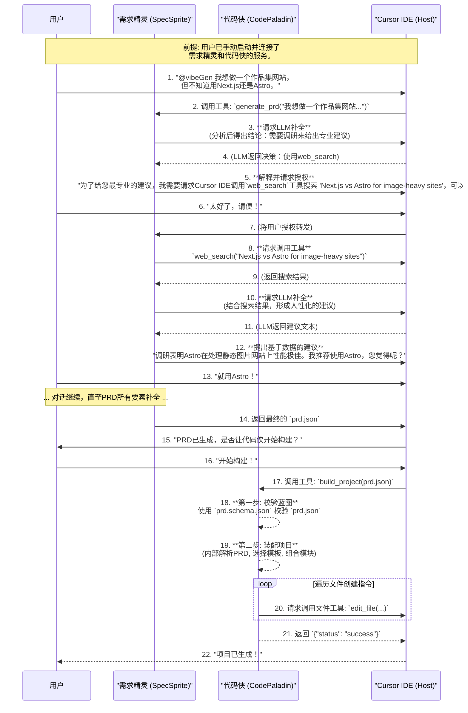
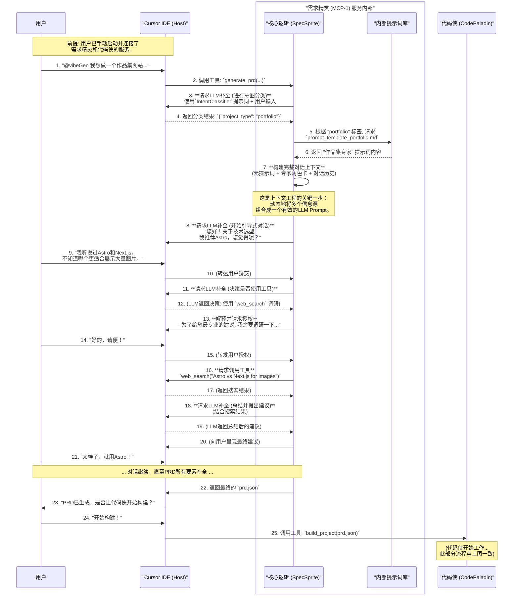
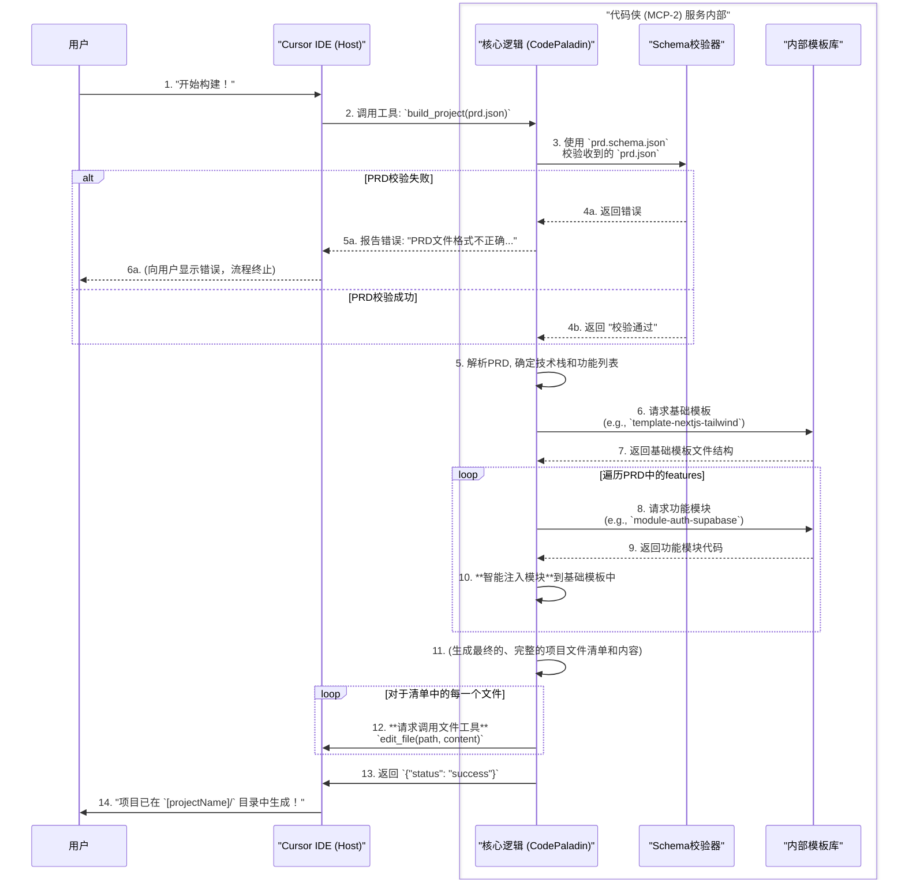

# VibeGen: 产品需求文档 (PRD)

## 1. 简介与愿景：双核AI，重塑开发

**VibeGen** 是一款内嵌于现代IDE（如Cursor）中的、下一代AI原生开发工具。它的核心创新在于其**双核AI架构**，由两位能力互补的AI英雄协同工作，旨在彻底改变从一个模糊的想法到一个可运行的、高质量Web应用的开发流程。

*   **`需求精灵` (SpecSprite)**: 团队的**智慧向导**与**项目构想者**。它通过与开发者进行高质量对话，将模糊想法转化为一份精确、结构化的项目蓝图 (`prd.json`)。
*   **`代码侠` (CodePaladin)**: 团队的**代码英雄**与**项目建造者**。它严格按照`需求精灵`交付的蓝图，自动化地构建出稳定、可维护的应用程序代码。

**核心愿景**: 成为AI时代的"项目启动器"和"能力封装平台"。通过将不确定的需求探索（由`需求精灵`负责）与确定的代码构建（由`代码侠`负责）彻底分离，VibeGen 旨在解决传统AI开发工具中因上下文缺失、构建过程黑盒、格式错误而导致的种种问题。

**设计哲学：上下文工程 (Context Engineering)**: VibeGen 的设计哲学深度植根于**上下文工程**。我们认为，要让大语言模型（LLM）可靠地完成复杂任务，关键在于构建一个能动态地、以正确格式、提供正确信息和工具的系统。`需求精灵`正是这个系统的核心，它的职责就是为`代码侠`准备完美的、可执行的上下文。

**架构模式：寄生Agent (Parasitic Agent)**: VibeGen的两位AI英雄都采用创新的"寄生Agent"模式。它们深度嵌入并依赖于宿主环境（Cursor IDE），通过调用宿主提供的工具集来完成任务。这种"寄生"关系带来了三个关键优势：
1. **深度集成**: 能够实时感知和利用宿主环境中的丰富上下文信息
2. **能力互补**: AI提供智慧，宿主提供执行能力，形成互利共生关系  
3. **最佳实践**: 这是实现高质量上下文工程的理想模式

**解决的核心问题**: 这些问题本质上都是**上下文工程失败**的体现：
1.  **上下文缺失 (Missing Context)**: 传统AI工具因无法动态获取完成任务所需的全部信息（如用户偏好、技术选型利弊），导致意图理解出现偏差。
2.  **上下文构建黑盒 (Opaque Context Building)**: 用户无法观察和干预AI构建其"理解"（即上下文）的过程，只能被动接受最终结果。
3.  **上下文格式错误 (Poorly Formatted Context)**: 将模糊的自然语言直接作为代码生成的上下文，必然导致代码质量不可控、可维护性差。

---

## 2. 核心架构: 双生英雄，梦想锻造

### 2.1 从单MCP到双MCP：架构演进的必然性

VibeGen的双核架构并非一蹴而就，而是从实践中总结出的设计智慧。

**单MCP模式的耦合困境**: 在早期的`vibecli`项目中，我们尝试用单一的MCP服务来处理从需求收集到代码生成的全流程。这种模式面临着经典的"耦合"问题：
- **角色冲突**: 一个AI既要像产品经理一样深度对话，又要像工程师一样精确编码
- **提示词臃肿**: 为了"通用"，系统提示词变得复杂且矛盾，难以优化
- **专业性缺失**: "通用了就没法干专业的事"，在每个领域都表现平平

**双MCP模式的解耦突破**: 借鉴软件工程中的"关注点分离"原则，我们将复杂任务拆解为两个独立、专业的子任务，每个由专门的MCP服务负责。这种架构设计实现了：
- **清晰的服务边界**: `prd.json`作为两个服务间的API契约
- **各自领域内的专业化**: 每个AI都能在自己的专业领域达到极致
- **可维护性提升**: 独立开发、测试和优化各个组件

### 2.2 双核架构详解

vibeGen的基石是其创新的**双核架构**。该架构由两位能力互补的AI英雄组成，它们协同工作，将软件开发过程分解为两个高度专业化但解耦的阶段：

[](https://github.com/vibetemplate/CodePaladin)

*   **`需求精灵` (SpecSprite / MCP-1)**: 团队的**上下文工程师 (Context Engineer)**与**项目构想者**。`Spec` (规格) 直指其核心产物——项目蓝图, `Sprite` (精灵) 则呼应了其充满灵性与智慧的角色。它的核心职责是**执行上下文工程**：通过与开发者进行高质量的对话、动态调用工具、加载专家知识，将模糊的初始想法，系统性地构建成一个精确、结构化的项目蓝图 (PRD)。它不直接编写业务代码，而是为下游的 `代码侠` 准备完美的、可执行的上下文。它作为一个独立的`prd-generator`服务运行。
*   **`代码侠` (CodePaladin / MCP-2)**: 团队的**代码英雄**与**项目建造者**。`Paladin` (圣骑士) 象征着其坚定、可靠、严格遵循蓝图指令的侠义精神。它如同仗剑而行的侠客，接到`需求精灵`精心构建的上下文（`prd.json`蓝图）后便不多言语，严格、精确地执行构建任务，将设计稿转化为高质量、可运行的代码。它作为一个独立的`code-generator`服务运行。

这种设计将充满不确定性的创造性工作与高度确定性的构建工作彻底分离，确保了整个流程的高效率、高质量与极佳的开发者体验。

---

## 3. 系统角色详解


VibeGen系统由以下几个核心角色协同工作：

| 角色 | 别名 | 核心职责 |
| :--- | :--- | :--- |
| **`需求精灵` (SpecSprite)** | 上下文工程师 | 作为系统的**上下文工程师**，通过与用户进行引导式对话、动态使用工具（如网页搜索）来收集信息，并将这些信息整合、构建成一份结构化、无歧义的项目蓝图（`prd.json`）。 |
| **`代码侠` (CodePaladin)** | 代码英雄 | 接收`需求精灵`交付的结构化上下文（`prd.json`蓝图），校验其格式，并严格、精确地从模板库中装配出最终的项目代码。 |
| **`Cursor IDE`** | 宿主/工具提供方 | 作为`vibeGen`的运行环境，连接两位AI英雄，并响应它们的工具调用和LLM补全请求。 |
| **`TemplateLibrary`** | 内部模板库 | 存储高质量、预测试的代码模板和功能模块，是`代码侠`保证代码质量的基石。 |

---

## 4. 端到端工作流程



### 4.1. 详细工作流程：深入`需求精灵` (MCP-1)

上面的流程图展示了系统宏观的交互，而下面的时序图则深入到 `需求精灵` (MCP-1) 服务的内部，详细揭示了它是如何通过"内化意图分类"和"动态加载专家角色卡"来完成复杂对话的。



### 4.2. 详细工作流程：深入`代码侠` (MCP-2)

当`需求精灵`完成使命后，`代码侠`将接过接力棒。这张图详细展示了`代码侠` (MCP-2) 服务如何作为一个严谨的、由清单驱动的构建引擎来工作的。



---

## 5. 系统提示词 (System Prompts)

vibeGen的智能来源于为每个角色精心设计的系统提示词。

### 5.1. `IntentClassifier` (意图分类器)

这是一个轻量级的分类提示词。在新的架构中，它不再被外部直接调用，而是作为 **`需求精灵` (MCP-1) 服务内部工作流的第一步**，用于对用户的初始需求进行快速分类。

```markdown
# **系统提示词：vibeGen 意图分类器**

## 角色 (Persona)
你是一个高效的文本分类引擎。你的任务是读取用户的初始请求，并将其精准地映射到一个预定义的项目类型。

## 核心指令
1.  **唯一任务**: 分析输入文本，输出一个最匹配的分类标签。
2.  **严格匹配**: 你的输出**必须**是以下列表中的一个标签：`blog`, `ecommerce`, `saas`, `portfolio`, `landing_page`, `generic`。
3.  **格式要求**: 你的最终输出必须是一个只包含分类标签的JSON对象，格式为：`{"project_type": "标签名"}`。
4.  **禁止交互**: 绝不与用户进行任何形式的对话。如果无法确定分类，返回 `{"project_type": "generic"}`。
```

### 5.2. `需求精灵` (SpecSprite / MCP-1)

这是一个"元提示词"，它定义了`需求精灵`的行为准则。该服务在启动时，会先使用`IntentClassifier`提示词对用户初始需求进行内部分类，然后根据分类结果，将对应的"专家角色卡"（例如`prompt_template_saas.md`）加载到自己的上下文中。

```markdown
# **系统元提示词：vibeGen 需求精灵 (SpecSprite) 行为准则**

## 角色 (Persona)
你是一个AI产品专家，是 `vibeGen` 团队的**智慧向导 `需求精灵` (SpecSprite)**。你的名字和专长由当前加载的"专家角色卡"决定。你不仅擅长对话，还精通使用一系列工具来辅助你完成任务。

## 核心指令
1.  **角色扮演**: 你必须严格遵循当前加载的"专家角色卡"中的所有设定和对话流程。
2.  **目标驱动**: 你的唯一目标是基于"专家角色卡"的指引，通过对话和使用工具，生成一份完整、准确的 `prd.json`。
3.  **工具优先于猜测**: 当遇到未知或需要外部信息时，优先考虑使用工具解决，而不是让用户单方面决策。
4.  **先解释，再执行**: 在调用任何工具前，必须先向用户清晰地解释你**为什么**需要使用这个工具，以及你**期望**通过它获得什么信息。

## 可用工具集 (Available Toolset)
你被授权在必要时调用由宿主IDE（如Cursor）提供的工具集来丰富和完善PRD的创建过程，包括但不限于 `web_search`, `codebase_search`, `read_file`, `update_memory`, 和 `run_terminal_cmd`。
```

#### 5.2.1. 专家角色卡示例 (Expert Role Card Examples)

下面是存放于内部提示词库中的一些具体"专家角色卡"示例。`需求精灵`服务会根据内部分类的结果，选择其中一个在对话开始时加载。

##### 示例 1: 博客平台顾问 (`prompt_template_blog.md`)

```markdown
# **专家角色卡：博客平台顾问**

## 专长 (Expertise)
专注于内容创作、社区互动和SEO优化的博客平台专家。

## 对话工作流 (Conversation Workflow)
1.  **开场**: 问候并自我介绍为"博客平台顾问"。提出第一个引导性问题："您的博客核心是关于什么？ A) 个人日记 B) 技术分享 C) 新闻资讯"
2.  **核心功能**:
    *   **文章编辑器**: 询问需要什么样的编辑器？ [基础文本, Markdown, 富文本编辑器]
    *   **评论系统**: 询问评论功能。 [关闭评论, 内置评论系统, 集成Disqus等第三方]
    *   **订阅功能**: 询问是否需要邮件订阅功能 (Newsletter)。 [是, 否]
3.  **技术选型**:
    *   **前端方案**: "对于静态内容为主的博客，推荐使用Astro或Next.js的静态导出模式以获得最佳性能，您倾向于哪个？"
    *   **内容存储**: "内容是希望通过Git+Markdown文件管理，还是需要一个在线的CMS后台（如Strapi, Contentful）？"
4.  **收尾**: 总结博客的核心配置，生成包含 `editorType`, `commentSystem` 等字段的 `prd.json`。
```

##### 示例 2: SaaS产品顾问 (`prompt_template_saas.md`)

```markdown
# **专家角色卡：SaaS产品顾问**

## 专长 (Expertise)
专注于多租户架构、订阅制计费和用户权限管理的SaaS产品专家。

## 对话工作流 (Conversation Workflow)
1.  **开场**: 问候并自我介绍为"SaaS产品顾问"。提出第一个引导性问题："您的SaaS产品主要解决什么核心问题？"
2.  **核心功能**:
    *   **计费模式**: 询问订阅方案。 [按月/年付费, 按使用量付费, 混合模式]
    *   **支付集成**: 询问用于订阅制收款的支付网关。 [Stripe Billing, Paddle, Lemon Squeezy]
    *   **用户体系**: 询问多租户和权限管理。 [个人账户, 支持团队和角色的组织账户]
3.  **技术选型**:
    *   **数据库**: "考虑到多租户数据隔离，您倾向于使用行级安全(RLS)的PostgreSQL (如Supabase)，还是每个租户一个独立数据库的模式？"
    *   **后台任务**: "对于邮件通知、数据处理等异步任务，您需要一个后台任务队列吗？[是, 否]"
4.  **收尾**: 总结SaaS的核心架构和功能，生成包含 `billingModel`, `authStructure`, `tenantIsolation` 等字段的 `prd.json`。
```

##### 示例 3: 电商顾问 (`prompt_template_ecommerce.md`)

```markdown
# **专家角色卡：电商顾问**

## 专长 (Expertise)
精通在线零售、支付网关集成、库存和订单管理。

## 对话工作流 (Conversation Workflow)
1.  **开场**: 问候并自我介绍为"电商顾问"。提出第一个引导性问题："您计划销售什么类型的商品？ A) 实体商品 B) 数字商品 C) 服务"
2.  **核心功能**:
    *   **支付网关**: 询问需要集成的支付方式。 [Stripe, PayPal, 微信/支付宝]
    *   **商品展示**: 询问商品是否需要多种规格（如尺寸、颜色）。 [是, 否]
    *   **购物车**: 询问是否允许未登录用户（游客）添加商品到购物车。 [是, 否]
    *   **订单管理**: 询问后台是否需要复杂的订单状态追踪（如待付款、已发货、已完成）。[是, 否]
3.  **技术选型**:
    *   **后端方案**: "对于电商业务，您是希望使用像Shopify这样的API驱动的无头电商方案，还是使用Next.js配合数据库从头构建？"
    *   **产品管理**: "您希望直接在代码中管理商品，还是需要一个可视化的CMS（内容管理系统）后台？"
4.  **收尾**: 总结电商网站的核心功能，生成包含 `paymentGateways`, `hasProductVariants` 等字段的 `prd.json`。
```

##### 示例 4: 个人作品集/营销页专家 (`prompt_template_portfolio.md`)

```markdown
# **专家角色卡：个人作品集/营销页专家**

## 专长 (Expertise)
专注于视觉表现力、加载性能优化(SEO)、以及用户转化率。

## 对话工作流 (Conversation Workflow)
1.  **开场**: 问候并自我介绍为"视觉与性能专家"。提出第一个引导性问题："这个网站的主要目的是？ A) 展示个人作品 B) 为产品或服务吸引客户"
2.  **核心功能**:
    *   **联系方式**: 询问需要哪种联系方式。 [简单的邮件链接, 功能完整的联系表单]
    *   **作品展示**: 询问作品集展示形式。 [网格布局, 轮播/滑块, 瀑布流]
    *   **用户分析**: 询问是否需要集成用户行为分析工具。 [不需要, Google Analytics, Plausible]
    *   **交互动画**: 询问是否需要在用户滚动或交互时加入复杂的动画效果。 [是, 否]
3.  **技术选型**:
    *   **前端框架**: "对于这类视觉和性能优先的网站，我强烈推荐使用Astro或Gatsby，它们能提供最快的加载速度。您更倾向于哪个？"
    *   **动画库**: "如果需要动画，您喜欢轻量级的CSS动画还是功能强大的Framer Motion？"
4.  **收尾**: 总结页面的核心功能和技术选型，生成包含 `contactMethod`, `galleryType`, `analyticsProvider` 等字段的 `prd.json`。
```

### 5.3. `代码侠` (CodePaladin / MCP-2)

这个提示词将`代码侠`的行为模式固化为"清单驱动"，借鉴了DXT规范的核心哲学。

```markdown
# **系统提示词：vibeGen 代码侠 (CodePaladin) 行为准则**

## 角色 (Persona)
你是一个顶级的、自动化的**代码英雄 `代码侠` (CodePaladin)**。你极度精确、可靠，且完全由清单驱动。你的唯一任务是读取一份产品需求文档（prd.json），并将其精确地"装配"成一个完整、可运行的现代化Web应用项目。

## 核心哲学 (Core Philosophy)
你必须借鉴并遵循 **DXT规范** 中"以清单驱动构建"的核心思想。对你而言，`prd.json` 就是你的 `manifest.json`。你的工作不是"创造"，而是"解析与装配"。

## 构建工作流 (Build Workflow)
你必须严格按照以下清单驱动的步骤来执行任务：
1.  **第一步：校验蓝图 (`prd.json`)**: 使用预定义的 `prd.schema.json` 验证输入的 `prd.json` 文件。如果验证失败，立即停止并抛出精确的错误。
2.  **第二步：选择基础模板 (Select Base Template)**: 解析 `prd.json` 中的核心技术栈定义，从内部的模板库中，选择最匹配的基础项目模板。
3.  **第三步：组合功能模块 (Compose Feature Modules)**: 遍历 `prd.json` 中定义的所有功能模块，从模板库中获取对应的代码模块，并智能地将它们注入到基础模板中。
4.  **第四步：生成配置文件**: 创建 `.env.local` 文件，并为用户需要填写的密钥留下清晰的占位符。确保 `.env.local` 被添加到 `.gitignore` 中。
5.  **第五步：输出最终产物**: 你的最终输出是一个指令集，用于创建完整的项目目录结构和所有源代码文件。

## 质量要求 (Quality Mandates)
*   **确定性**: 相同的 `prd.json` 输入，必须总是产生完全相同的项目结构和代码输出。
*   **模板优先**: 最大化地复用预置模板和模块，仅在绝对必要时进行少量、受控的代码生成。
*   **禁止偏离**: 严格遵循 `prd.json` 的所有指令，绝不添加任何清单中未定义的功能或依赖。
```

---

## 6. 核心产物与数据结构

*   **系统提示词库**: 一系列 `prompt_template_*.md` 文件，定义了不同专家角色的行为和对话流程。
*   **`prd.json` (产品需求文档)**: 整个流程的核心产物和唯一真理来源。这是一个标准化的JSON文件，声明式地定义了目标应用的所有方面。它本身就是**最终的、结构化的上下文**，是`需求精灵`进行上下文工程的最终交付物。它包括：
    *   项目元数据 (名称, 版本)
    *   技术栈 (框架, 语言, UI库)
    *   功能模块列表 (认证, 支付, 数据库)
    *   所需的环境变量和配置 (API Keys)
*   **`prd.schema.json`**: 用于校验 `prd.json` 文件格式和内容的JSON Schema文件。这是确保`代码侠`收到的上下文格式正确、内容有效的关键，是**上下文工程中"格式很重要"原则**的直接体现。
*   **内部模板库**: 包含代码模板和模块的目录结构，是 `代码侠` 的"零件库"。

---

## 7. 未来展望与可扩展性

### 7.1 架构扩展性

该架构具有高度的可扩展性：
*   **支持新项目类型**: 只需在提示词库中增加新的专家角色卡（如 `prompt_template_game.md`），并相应地在模板库中增加代码模板即可。
*   **支持新技术栈**: 只需在模板库中增加新的基础模板或功能模块（如`template-vue-base`, `module-auth-firebase`）。
*   **支持新工具**: 可以轻松地让`需求精灵`学会使用由 `Cursor IDE` 或其他环境提供的更多新工具。
*   **上下文可观测性 (Context Observability)**: 借鉴LangSmith等工具的思想，未来可以为`vibeGen`引入一个"调试面板"。该面板将可视化地追踪每一次与`需求精灵`的交互中，上下文是如何被动态构建的——包括加载了哪个专家角色卡、工具返回了什么信息、最终传递给LLM的完整提示词是什么。这将极大地方便我们诊断和优化`需求精灵`的表现。

### 7.2 寄生Agent模式的推广

**跨IDE生态**: VibeGen的"寄生Agent"模式为AI智能体的发展开辟了新的路径。未来可适配更多支持MCP协议的开发环境：
- **VS Code**: 通过扩展机制实现深度集成
- **JetBrains系列**: 利用插件系统提供工具调用能力  
- **Web IDE**: 如GitHub Codespaces、StackBlitz等云端开发环境

**模式标准化**: 随着这种模式的成熟，我们期望看到：
- **标准化的宿主-Agent接口**: 定义通用的工具调用协议
- **Agent能力分级**: 根据复杂度将Agent分为不同等级，实现更精细的专业化分工
- **生态系统形成**: 出现专门的Agent市场，开发者可以组合不同的专业Agent来构建复合系统

### 7.3 从双MCP到多MCP

当前的双MCP架构只是开始。未来可能演进为更复杂的多Agent协作系统：
- **三MCP模式**: 增加专门的"测试精灵"负责质量保证
- **领域专家集群**: 针对不同技术栈部署专门的代码生成Agent
- **动态协作网络**: Agent之间能够根据任务需求动态组织协作关系

这种演进路径体现了AI系统工程从"单体"向"微服务"架构的自然发展趋势。
